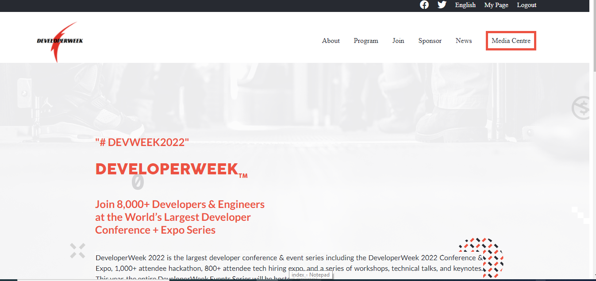

# Capstone-Project:
# Conferece Website(DeveloperWeek)
 Responsive Web Template:

- This project is a  conference+Expo Series website .Anyone can come and join the conferece all around the world and able to view the date and time  and also access the information of the event Speakers and upcoming events.

# Build with

# Languages :

 - HTML 
 - CSS 
 - JavaScript

 # Live Demo :
 
[Live demo here](https://ifzarasool.github.io/Capstone-Project/) 

# Installaion:
 - Linters 
 - npm 
 - webhint 
 - stylelintrc

 # FrameWork:

 visual studio code/optional

# 👤 Author

[GitHub](https://github.com/IfzaRasool)
Twitter: @IfzaRasool
[LinkedIn](https://www.linkedin.com/in/ifza-arain-0b922b102/)

# 🤝 Contributing

Contributions, issues, and feature requests are welcome!

Feel free to check the issues page.

# Show your support

Give a ⭐️ if you like this project!

# Acknowledgments

Design and inspiration by Cindy Shin on Behance.

# 📝 License

This project is [MIT](./MIT.md) licensed.

